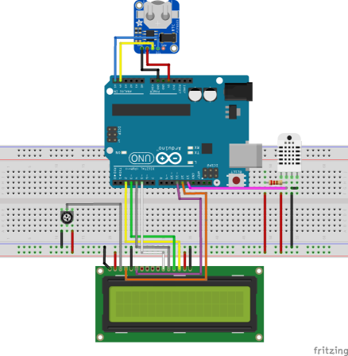

# Estudos Iniciais com Arduino - Construção de uma DataLogger de dados de temperatura e humidade

Esses projetos iniciais tem como objetivo ingressar nos estudos de tecnologias de IOT, com foco no fornecimento de dados coletados desses dispositivos para a construção de Modelos de Análise de Dados de forma aplicada.

A imagem corresponde ao último modelos composto pelo RTC, display e sensores. Nesse modelo final iniciei os teste com o sensor de Alta Precisão `HDC1080`. Infelizmente no Fritzing por padrão não vem com esse componente.

| |
| :--: |
| *Prototipo Inicial - Sem o leitor de cartão* |

- [Verificar o Sensor de Temperatura e humidade](0-temperaturaDht11.ino)

- [Display LCD exibindo a Temperatura e Humidade](1-temperatura_display.ino)

- [Usando o RTC e Exibindo a hora completa  e data com temperatura e humidade](2-temp_display_clock.ino)